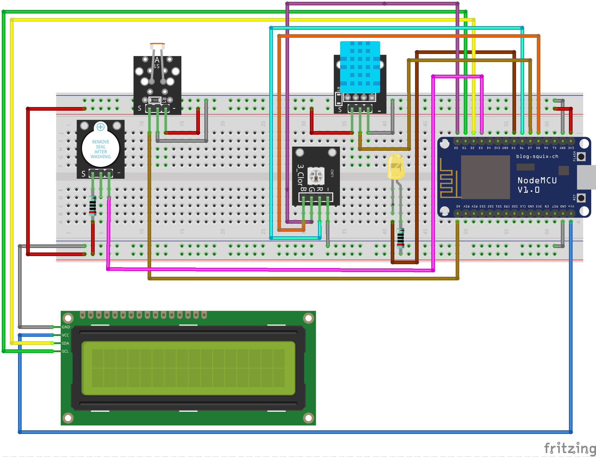

# 🐍 Terrario Monitor – ESP8266

Sistema di monitoraggio ambientale per terrari basato su **ESP8266**, con sensori di temperatura, umidità, luce e qualità del segnale WiFi.  
Il progetto integra un’interfaccia web moderna, un sistema di allarmi visivi e acustici e il salvataggio dei dati su **InfluxDB** per analisi storica.

---

## 📦 Componenti Utilizzati
- ESP8266 (NodeMCU  
- Sensore DHT11  
- Fotoresistore (LDR) 
- Display LCD 16×2 con interfaccia I2C  
- LED RGB  
- LED esterno + resistenza 
- Buzzer + resistenza
- Alimentazione USB  
- Cablaggi e breadboard 

---

## ⚙️ System Description

### **Timing**
Il sistema esegue un ciclo di lettura ogni **5 secondi**, durante il quale acquisisce temperatura, umidità, luce e RSSI.  
La dashboard web si aggiorna automaticamente ogni **3 secondi**, garantendo una visualizzazione in tempo reale.

### **Data Storage**
Tutti i dati vengono inviati a **InfluxDB 2.x** nella measurement `terrario`, con i campi:
- `t` → temperatura  
- `h` → umidità  
- `l` → luce  
- `rssi` → segnale WiFi  
- `led` → colore LED attivo  

Questo permette analisi storiche, grafici e trend.

### **User Controls**
L’interfaccia web consente di:
- Impostare le soglie di temperatura, umidità e luce  
- Avviare o arrestare il sistema  
- Silenziare o riattivare il buzzer  
- Monitorare in tempo reale i valori e lo stato degli allarmi  

---

## 🧩 Design Choices, Parameters, and Data Flow

Il sistema è progettato per essere semplice e affidabile: l’ESP8266 gestisce sensori, logica di controllo e server web in un unico modulo.  
Le soglie configurabili permettono di adattare il comportamento del sistema a diversi tipi di terrari.

Il flusso dati segue un percorso lineare:
1. Lettura sensori  
2. Confronto con le soglie impostate  
3. Aggiornamento LED, buzzer e LCD  
4. Invio dati a InfluxDB  
5. Aggiornamento dashboard web  

---

## 📊 Results, Discussion, and Conclusion

Il sistema ha dimostrato stabilità e affidabilità: le letture sono coerenti, la logica dei LED rende immediata l’identificazione delle condizioni critiche e il buzzer interviene solo quando necessario e la dashboard web è fluida e intuitiva.

L’architettura risulta efficace e facilmente estendibile.  
Possibili sviluppi futuri includono:
- Sensori più precisi (es. DHT22, SHT31)  
- Controlli attivi dell’ambiente (luci, nebulizzatori, ventole)  
- Notifiche automatiche (Telegram, email)  
- Dashboard grafica integrata senza strumenti esterni  

In conclusione, il progetto fornisce un monitoraggio continuo, chiaro e gestibile, costituendo una base solida per ulteriori evoluzioni.

